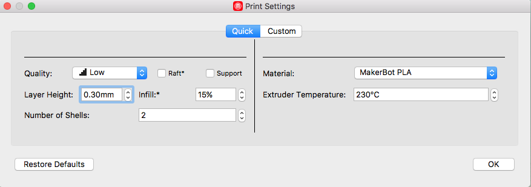

# Assignment

There are two parts to Assignment 1.  They do not be completed in order (in fact, if you do, you might run out of time).

## Part 1: 3D Printing

The base enclosure parts have been pre-printed and provided to you, to allow you to assemble a barebones LAMPI.  You need to print two parts in White PLA in think\[box\]:

* [LED support column - printned in White PLA](../../Lampi/Hardware/3DPrinting/lampi-print-white-led-column.stl)
* [Shade - printed in White PLA](../../Lampi/Hardware/3DPrinting/lampi-print-white-shade.stl)

### Print Settings

Please print the parts with the following settings in MakerBot Desktop:

* Low Quality (0.3mm Layer Height)
* No Raft (Raft Disabled)
* No Support (Support Disabled)
* 10% Infill
* 2 Shells
* MakerBot PLA
* 230 degrees C (the default)

### Print Times

On the MakerBot printers in think\[box\], the print times for each part are _approximately_:

* LED Support Column - 1 Hour
* Shade - 2 Hours

These times do not include machine setup, configuring the software, etc.

Both parts can be put onto the build plate and printed together (with print time roughly being equal to the sum of the individual print times), or printed separately.  

**NOTE: you need to remain with the MakerBots in think\[box\] until your print completes.  You are free to work on homework, etc., though while it is printing.**

**NOTE:** when printing the LAMPI Shade be sure that the model is oriented in the software such that the "top" (closed end) of the the shade is facing down (laying on the print bed).  That will leave the "bottom" (open end) at the top of the print.  This insures that there is sufficient material in contact with the print bed for bed adhesion, and that no supports are required.

**NOTE:** when printing the LAMPI Shade be sure that the model is oriented in the software such that the "top" (closed end) of the the shade is facing down (laying on the print bed) - you are essentially printing a rectangular cup shape.  That will leave the "bottom" (open end) at the top of the print.  This insures that there is sufficient material in contact with the print bed for bed adhesion, and that no supports are required.

**NOTE:** similarly, when pritning the LED support column, the "foot" or bottom of the column should be positioned to sit on the print bed, again maximizing adhesion and eliminating any need for supports.

## Part 2:  LED Control via Python

Write a Python script using one or more loops to produce the following effects, in order:

1. Turn off all LEDs
1. Delay 1 second
1. Over a period of 1 second, smoothly ramp the Red light from 0% to 100% intensity, and then back to 0% (i.e., half second ramp up, half second ramp down). 
1. Over a period of 1 second, smoothly ramp the Green light from 0% to 100% intensity, and then back to 0% (i.e., half second ramp up, half second ramp down). 
1. Over a period of 1 second, smoothly ramp the Blue light from 0% to 100% intensity, and then back to 0% (i.e., half second ramp up, half second ramp down). 
1. Over a period of 1 second, smoothly ramp White light from 0% to 100% intensity, and then back to 0% (i.e., half second ramp up, half second ramp down). 
1. Return to Step #1 (loop forever)

## GPIO Assignments
* The Red light color channel is controlled by GPIO19
* The Green light color channel is controlled by GPIO26
* The Blue light color channel is controlled by GPIO13

## Lab Demonstration
Please be prepared to demo your system at the very start of the next class (you might want to arrive a few minutes early to make sure your system boots up and is working properly).

## What to turn in

### Part 1
Show off your 3D printed parts in class

### Part 2

Before the start of class next week, one member of each pair should send an email to the instructor with the following:

* Subject:  Assignment 1
* Names of the members of pair
* A short (a few sentences) write up from each member of the pair summarizing what they learned completing the assignment, and one thing that surprised them (good, bad, or just surprising).
* Attach the file containing the required Python script
* Attach a short (5-10 second) video demonstrating the required lamp behaviors.

## Notes
* The following *pigpio* functions might be useful:
  * [_set_PWM_dutycycle()_](http://abyz.co.uk/rpi/pigpio/python.html#set_PWM_dutycycle)
  * [_set_PWM_range()_](http://abyz.co.uk/rpi/pigpio/python.html#set_PWM_range)
  * [_set_PWM_frequency()_](http://abyz.co.uk/rpi/pigpio/python.html#set_PWM_frequency)
* The following Python *time* function might be useful:
  * [_sleep()_](https://docs.python.org/2/library/time.html#time.sleep)
* The Python [_range()_](https://docs.python.org/2/library/functions.html#range) built-in function might be useful.
* Please have everything you need setup and ready to demonstrate before class starts

Other documentation:
* [https://wiki.python.org/moin/ForLoop](https://wiki.python.org/moin/ForLoop)

&copy; 2015-17 LeanDog, Inc. and Nick Barendt
