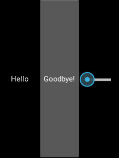
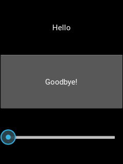
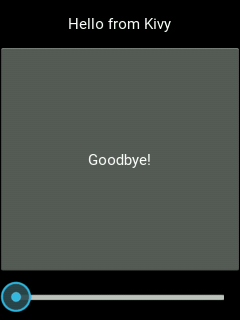
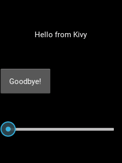

# Hello, Kivy

### Installing Kivy
First we need to get Kivy installed. Run the following. Cython and Kivy will take a while to build and install.
```
sudo apt-get update
sudo apt-get install -y python-pygame python-pip python-dev libmtdev1
sudo pip install cython
sudo pip install kivy
```

We're installing [pygame](http://www.pygame.org/lofi.html) a multimedia/game creation system, then`pip`, a Python dependency manager,  then using pip to install `cython` and `kivy` ([Cython](http://cython.org/) makes it easy to integrate Python and C/C++ code; [Kivy](https://kivy.org/#home) is a cross-platform GUI framework for Python). `python-dev` installs the Python header files which are needed to build Kivy.  `libmtdev1` installs a multitouch library for use with Kivy and the touchscreen.

> **COMPATIBILITY:** unfortunately, there's a bug in the current release of Kivy (1.9.1) that we need to fix.  In the ```Lampi/scripts``` directory is a [patch](https://linux.die.net/man/1/patch) file ```Lampi/scripts/0001-fixes-crashing-on-RPi.patch``` based on a Kivy [commit](https://github.com/kivy/kivy/commit/72d0e0a739ff54409a337f5d9e03d177b2b1d5d5).
> Apply this patch like so:
>
> ```
> cd /usr/local/lib/python2.7/dist-packages/
> sudo patch -p1 < ~/eecs397/Lampi/scripts/0001-fixes-crashing-on-RPi.patch
> cd ~
> ```

### Kivy on PiTFT screen
The PiTFT touchscreen is a little quirky, so we need to change some settings to transform the input into something usable.

First, we need kivy to generate the config file both for your current user and for root, so that we can modify it. Run the following commands (quitting the app after it starts):
```
$ python -c "from kivy.app import App;App().run()"
$ sudo python -c "from kivy.app import App;App().run()"
```

This will create config.ini files at **/home/[user]/.kivy/config.ini**, and **/root/.kivy/config.ini**, respectively.

Next, edit **both** files and make the ```[input]``` section look like this:

```
[input]
mouse = mouse
pitft = mtdev,/dev/input/touchscreen,max_position_x=240,max_position_y=320
%(name)s = probesysfs,provider=mtdev
```

(Hint: to edit root's copy of the file, you will probably do something like ```sudo nano /root/.kivy/config.ini```

Your touchscreen should now work normally in Kivy apps.

### Starting an app
To create a kivy app we need to start by subclassing `kivy.app.App`. Create a new file called **hello_app.py** and enter the following:

```
from kivy.app import App

class HelloApp(App):
    pass
```

A couple things going on here:
```
from kivy.app import App
```
This is an import statement that allows us to reference [App](http://kivy.org/docs/api-kivy.app.html). This allows us to subclass App here:
```
class HelloApp(App):
```
`class` is a keyword in Python used to declare a class. `HelloApp` is the name of our new class. `App` is the subclass.

Finally, there's this:
```
    pass
```

Classes in Python cannot be empty, so we use `pass` to indicate "there's nothing else in here". Once the class has content (methods, properties, anything) we can remove the pass statement.

### Running the app

We need to run the app. From your terminal, run `python` to open a REPL prompt. Enter the following commands:

```
from hello_app import HelloApp
HelloApp().run()
```

You should see some Kivy debug output in the terminal and the screen will remain black. Assuming no errors appear in the terminal, congratulations! You wrote your first Kivy app.

Press **CTRL+C** to exit the Kivy app, then run `exit()` to exit Python REPL.

### Running the app, part 2

It is laborious to perform this in the REPL prompt everytime we run the app, so we are going to set up script we can run to launch the app easily. Create a file called **main.py** and enter the following:
```
from hello_app import HelloApp

if __name__ == "__main__":
    HelloApp().run()
```

This is the same code you ran in REPL, with one difference:
```
if __name__ == "__main__":
```

`__name__` is a special property on Python modules that is set to `'__main__'` if the Python file was run directly as a script. This makes sure the app doesn't run if main.py should get imported as a module instead of run directly.

Save the file and exit. From the terminal, run
```
$ python main.py
```
The app should run as it did before.

### Running the app, part 3
Next lets make **main.py** executable directly, so that we don't need to pass it into `python`. Edit main.py so it reads like so:
```
#!/usr/bin/env python

from hello_app import HelloApp

if __name__ == "__main__":
    HelloApp().run()
```

That first line starts with a shebang (**#!**) which causes the trailing text to be used as a script interpreter. In this case, we're saying "use whatever version of Python is found on the system path":
```
#!/usr/bin/env python
```

Next, we need to mark the file as executable. Save and exit the file and run the following command:
```
sudo chmod a+x main.py
```

We're using chmod to set the executable bit on **main.py** so that it can be executed directly. From the terminal, run:
```
./main.py
```

The Kivy app should run as it did in previous steps.

### Adding UI

Now it's time to actually show something on the screen. Add a new file called **hello.kv**.

> NOTE: Kivy will look for a kv file named the same as your app (minus the "App" part) and automatically load it as the root UI. In this case, we have a **HelloApp** so our kv file is **hello.kv**.

For reference during this lab, here are the docs for [kv syntax](http://kivy.org/docs/guide/lang.html).

Let's start simply with a Label:

```
#:kivy 1.9

Label:
  text: 'Hello from Kivy'
```

Note the version number. This declares which version of kivy the files are syntax compatible with. This is only needed in this first app kv file (apps can contain multiple kv files).

Secondly, we are creating a [Label](http://kivy.org/docs/api-kivy.uix.label.html) as our root widget. This will be the only thing in our app. **text** is a property of Label. Note that it is lowercase and indented. Like Python, kv files are whitespace sensitive.

Go ahead and run **main.py**. You should see a black screen with "Hello from Kivy" in white.


### Layouts

The previous exercise works when there is a single control, but what about multiple controls? Kivy provides layout widgets that exist to handle the layout of their children in different ways. For reference, [here are the different layout controls available](http://kivy.org/docs/gettingstarted/layouts.html).

For now we will just demonstrate [BoxLayout](http://kivy.org/docs/api-kivy.uix.boxlayout.html), which stacks children sequentially, either left-to-right or top-to-bottom depending on orientation. Change **hello.kv** to add a BoxLayout with a few children:
```
#:kivy 1.9

BoxLayout:
  Label:
    text: 'Hello'
  Button:
    text: 'Goodbye!'
  Slider:
```

Run **main.py** to see the result. By default, BoxLayout wtill stack the controls horizontally:



To control the orientation, set the **orientation** property to 'horizontal' or 'vertical':
```
BoxLayout:
  orientation: 'vertical'
```


To control the size of the controls in the layout, you can use **size_hint_x** or **size_hint_y**. This specifies the size ratio between children.

```
#:kivy 1.9

BoxLayout:
  orientation: 'vertical'
  Label:
    size_hint_y: 0.15
    text: 'Hello'
  Button:
    size_hint_y: 0.7
    text: 'Goodbye!'
  Slider:
    size_hint_y: 0.15
```



So in this case, the button takes up 70% of the vertical space and the other controls take up 15% each.

Finally, if you want precise control over the size of your controls, you can set size_hint to `None` and set size to a specific value:

```
#:kivy 1.9

BoxLayout:
  orientation: 'vertical'
  Label:
    size_hint_y: 0.15
    text: 'Hello'
  Button:
    size_hint: None, None
    size: 100, 50
    text: 'Goodbye!'
  Slider:
    size_hint_y: 0.15

```

This creates a layout like so.



A couple interesting things here:

First, note that when a control is given a spcific **size**, it will take layout priority and take whatever space it needs (size_hint has to be set to None!). Then controls using **size_hint** will layout in the remaining space. The other two controls have a size hint of 0.15, **but those values are relative to each other**. Because they are equal values, they both take 50% of the remaining space.

Second, Kivy widgets provide several properties that are linked together by a "reference list property" that can be set via a list of values. In this case, we are setting **size_hint** to `None, None`. This is linked to the **size_hint_x** and **size_hint_y** properties, which will both be set to `None` here. There are several other properties you'll find like this. **pos** links **x** and **y**, **size** links **width** and **height**, **rgb** links **r**, **g**, and **b**, and so on.

Next up: go to [Events and Binding](../02.4_Events_and_Binding/README.md)

&copy; 2015-17 LeanDog, Inc. and Nick Barendt
